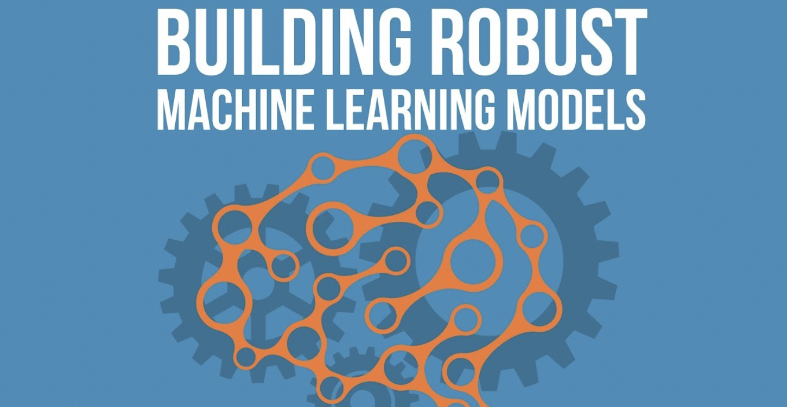
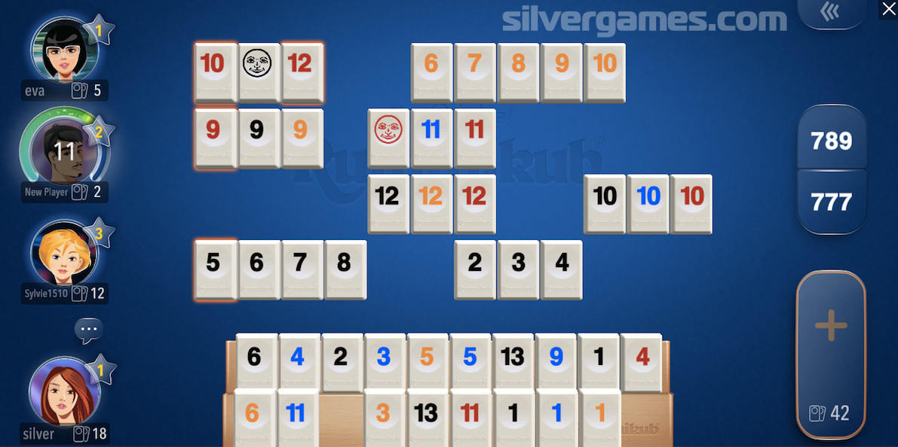
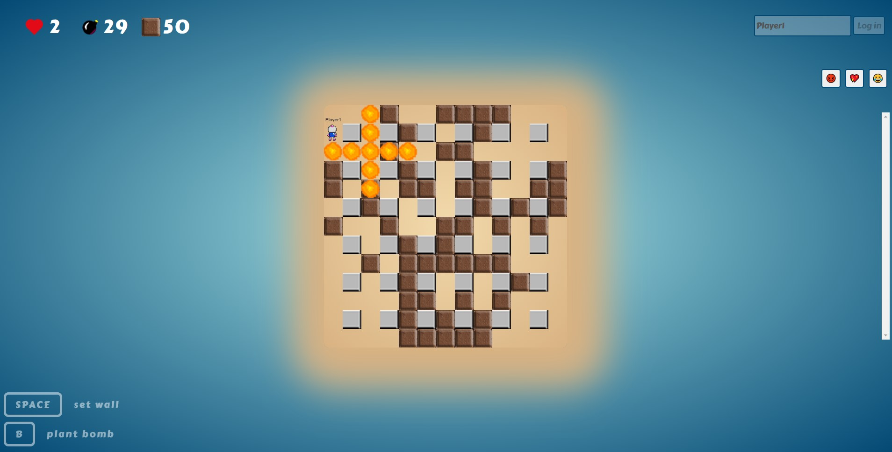

**Hi!** \
My name is [**Angelos Kafounis**](https://www.linkedin.com/in/angeloskafounis/) and in this website you can find awesome projects that I have been working on!

### Sentiment Analysis

The goal of this project is to build a deep learning model that is able to classify IMDB Movie reviews as positive or negative. For more information about the model architecture and the results see [Sentiment Analysis](https://akafounis.github.io/nlp-imdb/).

### Semantic Segmentation

I developed a deep learning model to be able to classify each pixel of an image to 23 different object classes. More information about the results and the architecture that was used for the model you can find [here](https://akafounis.github.io/dl-ss/).

### Facial Keypoints Detection

I created a deep learning model to be able to detect the main keypoints of a human face. Detecting the keypoints on the human face is the key to a lot of computer vision applications, such as Facial Recognition. More information about the results and the architecture that was used for the model you can find [here](https://akafounis.github.io/facial-keypoint).

### Robustness of Machine Learning Models

The goal of this project is to train a machine learning model in such a way that it is robust. For this purpose, we used adversarial training and randomized smoothing. For more information about the results see [Robustness of Machine Learning Models](https://akafounis.github.io/ml-robustness/).

### Normalizing Flows

The projects goal is to implement certain tranformations in order to construct flexible and learnable distributions. We used for this project 2 different datasets and 2 different transformations.

For more details see [Normalizing Flows](https://akafounis.github.io/normalizing-flows/).

### Bundle Adjustment

The projects goal is to show a sample application of Bundle Adjustment in reconstructing 3D scenes, and it involves three major steps of key features finding and matching, geometric estimation, and recovering the 3D structure of the scene using bundle adjustment.

For more details see [Bundle Adjustment](https://akafounis.github.io/bundle-adjustment/).

### Algorithmic Trading Bot

This project is about constructing an automated bot which in real-time takes information about the current state of the stock market, analyzes them using some certain techniques and based on the result of the analysis, it buys or sells its current stocks. 

For more details see [Trading Bot Source Code](https://akafounis.github.io/Algo-Trading-Bot/).

### 3D Back Projection

The goal of this project is to generate 3D meshes from depth and color maps which can be captured by depth cameras, like Microsoft Kinect.

For more details see [3d Back Projection Source Code](https://akafounis.github.io/3D-Back-projection/).

### Rummikub: Multiplayer Game

Multiplayer Online version of a card game called "Rummikub". Start the game, choose your username and the server and play!

For more details see [Bomberman](https://github.com/akafounis/Rummikub-Multiplayer-Game).

### Bomberman: Multiplayer Game

Multiplayer Online version of a game called "Bomberman". Start the game, choose your username, throw bombs with the purpose of destroying obstacles and killing your opponent. 

For more details see [Bomberman](https://akafounis.github.io/Bomberman-Multiplayer-Game/).
